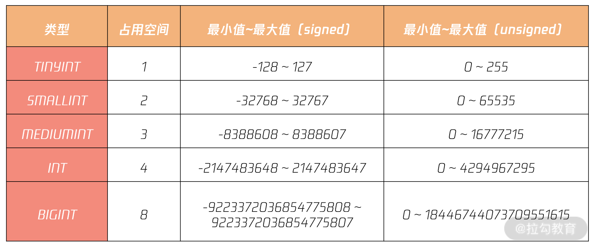

### 首先给出几个在我们平时设计数据库表要考虑的问题

1. 怎么设计一个互联网海量并发业务的自增主键？用 INT 就够了？  
2. 怎么设计账户的余额？用 DECIMAL 类型就万无一失了吗？


### 数字类型

* 整数类型

MySQL 数据库支持 SQL 标准支持的整型类型：INT、SMALLINT。此外，MySQL 数据库也支持诸如 TINYINT、MEDIUMINT 和 BIGINT 整型类型



其中在整型类型中，有 signed 和 unsigned 属性，其表示的是整型的取值范围，默认为 signed。

> 一般建议在设计的时候使用signed，因为使用unsigned进行设计的时候，如果进行了非等值查询或者运算的结果超过了unsigned的范围，尤其是结果得到了负数
> 的情况，而unsigned不支持负数标识，所以就会报错


* 浮点类型和高精度型

MySQL 之前的版本中存在浮点类型 Float 和 Double，但这些类型因为不是高精度，也不是 SQL 标准的类型，所以在真实的生产环境中不推荐使用，否则在计算时，由于精度类型问题，会导致最终的计算结果出错。
一般使用的是DECIMAL 类型，当声明该类型列时，可以（并且通常必须要）指定精度和标度

```text
salary DECIMAL(8,2)
```

其中，8 是精度（精度表示保存值的主要位数），2 是标度（标度表示小数点后面保存的位数）。通常在表结构设计中，类型 DECIMAL 可以用来表示用户的工资、账户的余额等精确到小数点后 2 位的业务。


### 业务开发中的注意

* 整型类型与自增设计

整型结合属性 auto_increment，可以实现自增功能，但在表结构设计时用自增做主键，希望你特别要注意以下两点，若不注意，可能会对业务造成灾难性的打击：

1. 用 BIGINT 做主键，而不是 INT；
2. 自增值并不持久化，可能会有回溯现象（MySQL 8.0 版本前）。

从表 1 可以发现，INT 的范围最大在 42 亿的级别，在真实的互联网业务场景的应用中，很容易达到最大值。例如一些流水表、日志表，每天 1000W 数据量，420 天后，INT 类型的上限即可达到。
因此，（敲黑板 1）用自增整型做主键，一律使用 BIGINT，而不是 INT。不要为了节省 4 个字节使用 INT，当达到上限时，再进行表结构的变更，将是巨大的负担与痛苦。这里注意***当达到 INT 上限后，再次进行自增插入时，会报重复错误，MySQL 数据库并不会自动将其重置为 1。***


* MySQL 8.0 版本前，自增不持久化，自增值可能会存在回溯问题！

可以看到，在删除自增为 3 的这条记录后，下一个自增值依然为 4（AUTO_INCREMENT=4），这里并没有错误，自增并不会进行回溯。但若这时数据库发生重启，那数据库启动后，表 t 的自增起始值将再次变为 3，即自增值发生回溯。

想要解决这个问题可以考虑：

1. 升级 MySQL 版本到 8.0 版本，每张表的自增值会持久化；
2. 若无法升级数据库版本，则强烈不推荐在核心业务表中使用自增数据类型做主键。

***其实，在海量互联网架构设计过程中，为了之后更好的分布式架构扩展性，不建议使用整型类型做主键，更为推荐的是字符串类型***


* 资金字段设计

在海量互联网业务的设计标准中，并不推荐用 DECIMAL 类型，而是更推荐将 DECIMAL 转化为 整型类型，也就是说，资金类型更推荐使用用分单位存储，而不是用元单位存储。如1元在数据库中用整型类型 100 存储。

金额字段的取值范围如果用 DECIMAL 表示的，如何定义长度呢？因为类型 DECIMAL 是个变长字段，若要定义金额字段，则定义为 DECIMAL(8,2) 是远远不够的。这样只能表示存储最大值为 999999.99，百万级的资金存储。
用户的金额至少要存储百亿的字段，而统计局的 GDP 金额字段则可能达到数十万亿级别。用类型 DECIMAL 定义，不好统一。

另外重要的是，类型 DECIMAL 是通过二进制实现的一种编码方式，计算效率远不如整型来的高效。因此，推荐使用 BIG INT 来存储金额相关的字段。

字段存储时采用分存储，即便这样 BIG INT 也能存储千兆级别的金额。这里，1兆 = 1万亿。这样的好处是，所有金额相关字段都是定长字段，占用 8 个字节，存储高效。另一点，直接通过整型计算，效率更高。

***注意，在数据库设计中，我们非常强调定长存储，因为定长存储的性能更好。***