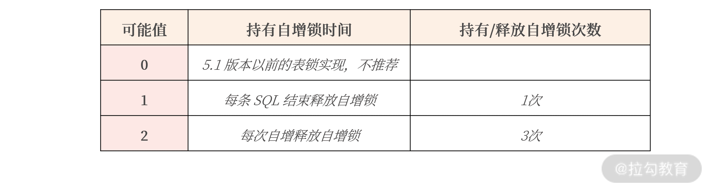

### 三大范式

1. 一范式要求所有属性都是不可分的基本数据项；
2. 二范式解决部分依赖；
3. 三范式解决传递依赖。
### 忘记范式准则


真实的业务场景是工程实现，表结构设计做好以下几点就已经足够：

* 每张表一定要有一个主键（方法有自增主键设计、UUID 主键设计、业务自定义生成主键）；
* 消除冗余数据存在的可能。

### 自增主键设计

使用 BIGINT 的自增类型作为主键的设计仅仅适合非核心业务表，比如告警表、日志表等。真正的核心业务表，一定不要用自增键做主键，主要有 6 个原因：

1. 自增存在回溯问题；
2. 自增值在服务器端产生，存在并发性能问题；
3. 自增值做主键，只能在当前实例中保证唯一，不能保证全局唯一；
4. 公开数据值，容易引发安全问题，例如知道地址http://www.example.com/User/10/，很容猜出 User 有 11、12 依次类推的值，容易引发数据泄露；
5. MGR（MySQL Group Replication） 可能引起的性能问题；
6. 分布式架构设计问题。

#### 自增值是在 MySQL 服务端产生的值


自增值是在 MySQL 服务端产生的值，需要有一把自增的 AI 锁保护，若这时有大量的插入请求，就可能存在自增引起的性能瓶颈。比如在 MySQL 数据库中，参数 innodb_autoinc_lock_mode 用于控制自增锁持有的时间。假设有一 SQL 语句，同时插入 3 条带有自增值的记录：

```mysql
INSERT INTO ... VALUES (NULL,...),(NULL,...),(NULL,...);
```

则参数 innodb_autoinc_lock_mode 的影响如下所示：



从表格中你可以看到，一条 SQL 语句插入 3 条记录，参数 innodb_autoinc_lock_mode 设置为 1，自增锁在这一条 SQL 执行完成后才释放。

如果参数 innodb_autoinc_lock_mode 设置为2，自增锁需要持有 3 次，每插入一条记录获取一次自增锁。

- 这样设计好处是： 当前插入不影响其他自增主键的插入，可以获得最大的自增并发插入性能。
- 缺点是： 一条 SQL 插入的多条记录并不是连续的，如结果可能是 1、3、5 这样单调递增但非连续的情况。
- 所以，如果你想获得自增值的最大并发性能，把参数 innodb_autoinc_lock_mode 设置为2。
- 因此，在互联网海量并发架构实战中，我更推荐 UUID 做主键或业务自定义生成主键。


### 总结

1. 每张表一定要有一个主键；
2. 自增主键只推荐用在非核心业务表，甚至应避免使用；
3. 核心业务表推荐使用 UUID 或业务自定义主键；
4. 一份数据应尽可能保留一份，通过主键关联进行查询，避免冗余数据；
5. 在一些场景下，可以通过 JSON 数据类型进行反范式设计，提升存储效率；
